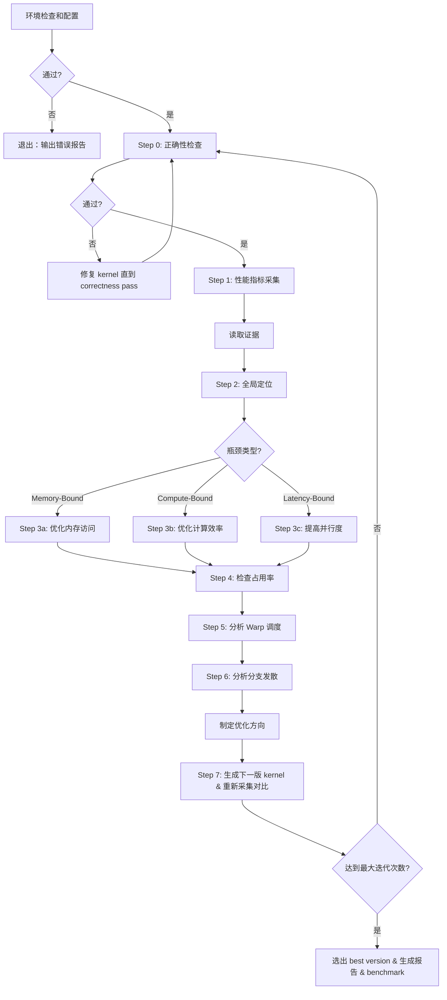

# kernel-opt-skill

## 优化流程



---

## sub-skill 路由

| sub-skill | location | 职责 |
|---|---|---|
| env | `env/SKILL.md` | 必要环境检查（含 Triton）+ 环境配置 |
| profiling | `profiling/SKILL.md` | 正确性检查 + NCU 采集 + 指标解读 + 瓶颈定位 |
| benchmark | `benchmark/SKILL.md` | solution 与 reference 框架横向对比（执行时间 + 硬件指标） |
| cuda | `cuda/SKILL.md` | CUDA 优化策略 |
| triton | `triton/SKILL.md` | Triton 优化策略 |
| report | `report/SKILL.md` | 生成优化流程报告 |

---

## 优化循环

**整个优化过程中的中间产物和 kernel 的迭代版本需要指定到一个目录中`<output_dir>`，如果未指定就在当前目录`<./>`**

**优化循环最大迭代次数默认 `N=3`，用户可指定其他值**：

一旦指定最大迭代次数 `N`，后续迭代版本数不可更改，在 `<output_dir>` 中生成 `N+1` 个子目录分别代表不同的版本：

```text
<output_dir>/
├── ref.py
├── env_check.md
├── v0/
│   ├── correctness.md
│   ├── ncu_summary.md
│   ├── ncu_details.md
│   └── v0.cu
├── v1/
│   ├── correctness.md
│   ├── ncu_summary.md
│   ├── ncu_details.md
│   └── v1.cu
├── v2/
│   ├── correctness.md
│   ├── ncu_summary.md
│   ├── ncu_details.md
│   └── v2.cu
├── v3/
│   ├── correctness.md
│   ├── ncu_summary.md
│   ├── ncu_details.md
│   └── v3.cu
├── final_report.md
└── benchmark.md
```

`v0` 为初始未优化版本，`v1` 表示第一次优化，`v2` 表示第二次优化，`v3` 表示第三次优化，以此类推

### 环境检查和配置（env-skill 负责）

* 环境检查为必要步骤，**不通过则直接退出**并输出问题详情
* 输出 `<output_dir>/env_check.md`，记录 CUDA/Triton kernel 优化的环境基础信息，后续所有环境信息均从此文件查询

### Step 0: 正确性检查（profiling-skill 负责）

* `ref.py` 为正确性检查的参考对比（reference），通常为 PyTorch 实现
* 输出 `<output_dir>/v{n}/correctness.md`
* 若正确性检查不通过，需检查并修复源码

### Step 1: 性能指标采集（profiling-skill 负责）

* 输出 `<output_dir>/v{n}/ncu_summary.md` 和 `<output_dir>/v{n}/ncu_details.md`，其中记录各项指标，是后续 CUDA/Triton kernel 优化方向的依据

### Step 2: 全局定位（profiling-skill & cuda-skill 负责）

* 根据 NCU 性能指标确定 `Memory-Bound`、`Compute-Bound` 和 `Latency-Bound` 类别，驱动 CUDA/Triton 两类实现的下一步优化方向，详见 `profiling/SKILL.md`

### Step 4: 检查占用率 / Step 5: 分析 Warp 调度 / Step 6: 分析分支发散（profiling-skill & cuda-skill 负责）

* 根据 NCU 采集的 `占用率`、`Warp 调度`、`分支发散` 等相关性能指标确定优化策略

### Step 7: 生成下一版 kernel & 重新采集对比

* 创建子目录`<output_dir>/v{n}`，在这个目录下生成下一版 kernel & 重新采集对比

### 选出 best version & 生成报告（report-skill 负责）& benchmark（benchmark-skill 负责）

* **当达到最大迭代次数后，停止优化，输出`<output_dir>/final_report.md`**
* 选取 **best version** 与 **reference implementation (PyTorch/CUTLASS)** 进行对比，输出`<output_dir>/benchmark.md`

---

## 架构速查

| 特性 | CC 7.x Volta/Turing | CC 8.x Ampere | CC 9.0 Hopper |
|---|---|---|---|
| Tensor Core | 第1/2代 | 第3代 | 第4代（FP8） |
| Shared Memory 上限 | 96 KB | 164 KB | 228 KB |
| L2 缓存 | 6 MB | 40–80 MB | 50 MB |
| `cp.async` | ✗/有限 | ✓ | ✓ + TMA |
| L2 Persistence | ✗ | ✓ | ✓ |
| Thread Block Cluster | ✗ | ✗ | ✓ |
